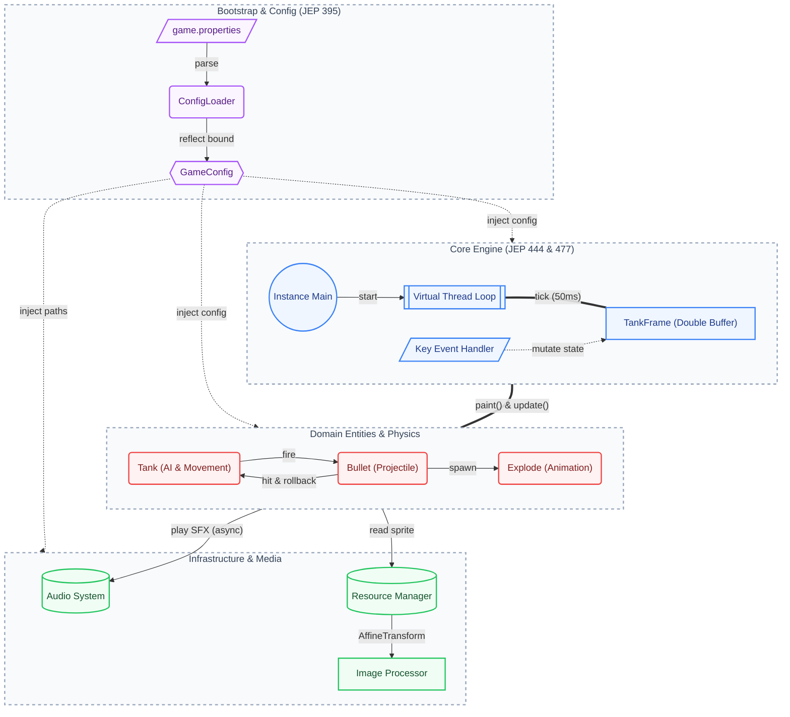

# 🎮 Tank War

**A classic tank battle game built purely in Java with modern language features.**

> *Control your tank, dodge enemy fire, and destroy all opponents!*

## ✨ Features

- 🕹️ **Real-time combat** — Smooth 20 FPS game loop powered by virtual threads
- 🎯 **Bullet & collision physics** — Bullet-tank hit detection, tank-tank collision with rollback
- 🤖 **Enemy AI** — Randomized movement, direction changes, and firing behavior
- 🔊 **Full audio system** — Background music toggle, fire/move/explosion sound effects
- 🖼️ **Sprite-based rendering** — Directional sprites with runtime image rotation
- ⚙️ **Externalized configuration** — All game parameters in `game.properties`, auto-bound to Java Records

## 🏗️ Architecture

## 🎮 Controls

| Key | Action |
| :---: | :--- |
| `↑` `↓` `←` `→` | Move tank |
| `Space` | Fire bullet |
| `Q` | Toggle background music |

## 📄 License

This project is licensed under the [MIT License](LICENSE).