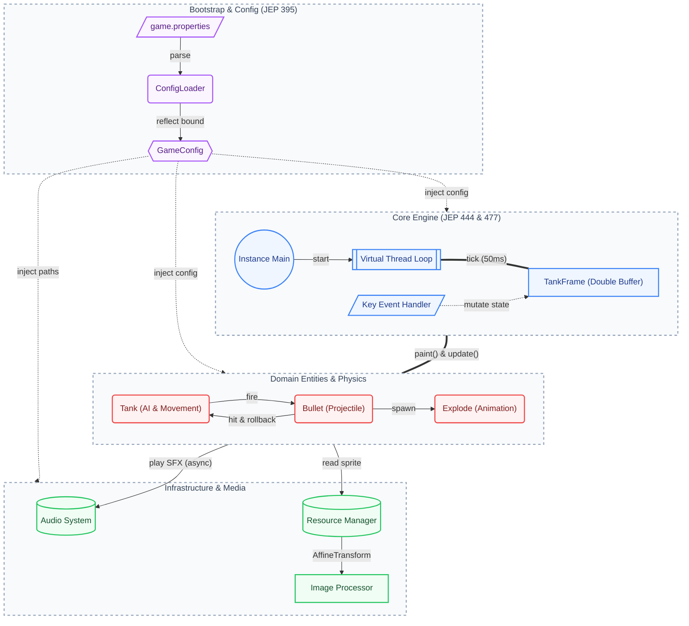

# 🎮 Tank War

[](https://openjdk.org/)
[](https://maven.apache.org/)
[](LICENSE)

**A classic tank battle game built purely in Java with modern language features.**

> *Control your tank, dodge enemy fire, and destroy all opponents!*

## ✨ Gameplay

- Defeat all enemy tanks to win the match.
- Getting destroyed ends the current round immediately.
- A pause overlay is shown when the game is paused, and a result overlay is shown after victory or defeat.
- Press `P` to pause or resume the current match.
- Press `R` to restart at any time, whether the round is still in progress or already over.

## 🏗️ Architecture



## 🎮 Controls

| Key | Action |
| :---: | :--- |
| `↑` `↓` `←` `→` | Move tank |
| `Space` | Fire bullet |
| `P` | Pause or resume the current match |
| `Q` | Toggle background music |
| `R` | Restart the current match |

## ▶️ How to Run

### Windows

- Download `tank-war-windows.zip` from GitHub Releases.
- Extract the archive.
- Open the extracted `tank-war` folder and run the application executable inside it.

### Linux

- Download `tank-war-linux.tar.gz` from GitHub Releases.
- Extract the archive:

```bash
tar -xzvf tank-war-linux.tar.gz
```

- Enter the extracted directory and run the launcher:

```bash
cd tank-war && ./bin/tank-war
```

### MacOS

- Build or download `tank-war.app`.
- If macOS blocks the app with a security warning, run the following command in Terminal and then try opening the app again:

```bash
sudo xattr -dr com.apple.quarantine tank-war.app
```

What this does:

- It removes the `com.apple.quarantine` attribute that macOS adds to files downloaded from the internet.
- It only affects the specified `tank-war.app` bundle on your own Mac.

Is it safe:

- For the app downloaded from this project, this step is expected and safe to use.
- This project is a personal learning game and is not signed or notarized with an Apple Developer account, so macOS may block it on some Macs until the quarantine attribute is removed.

### Run from source

If you prefer to run the game directly from source on any platform, make sure you have JDK 25 and Maven 3.9+ installed:

```bash
mvn clean package
java --enable-preview -jar target/tank-war-1.0-SNAPSHOT.jar
```

## 📄 License

This project is licensed under the [MIT License](LICENSE).
